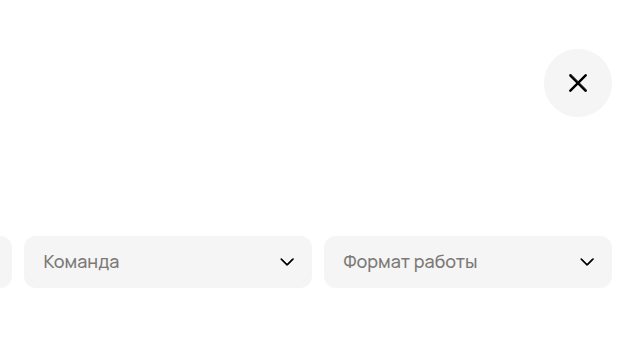
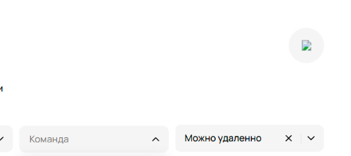

1. Битое изображение или вовсе его отсутствие. 
  Ожидаемый результат:
  

  Фактический результат:
  
  
  Priority : high (Потеря качества продукта, юзер не сразу поймет, что там должен быть крестик)
