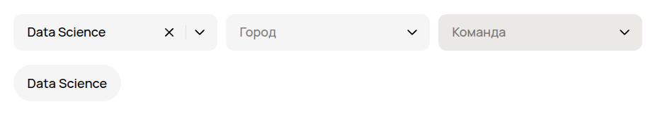
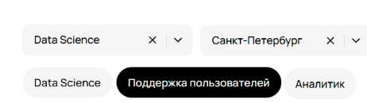
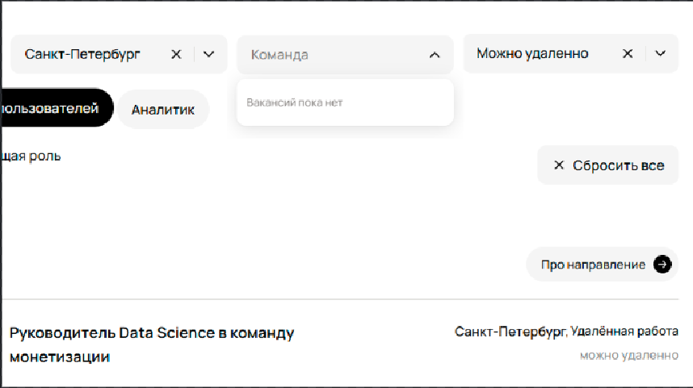
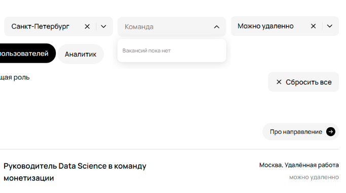
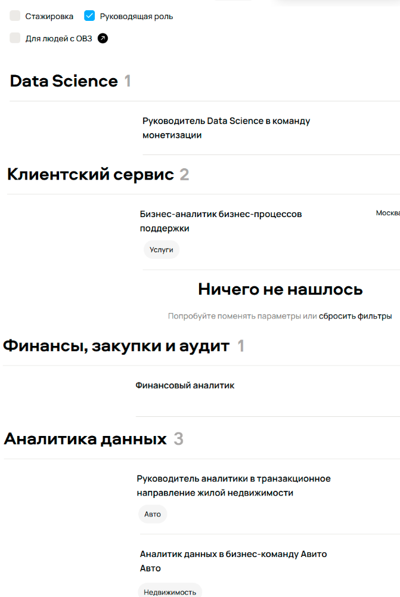
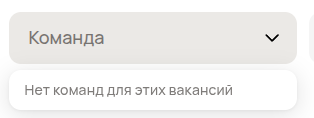
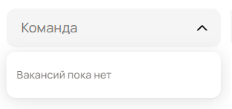
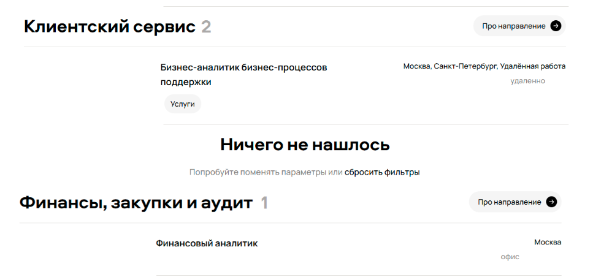
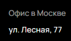

1. Битое изображение или вовсе его отсутствие.

  Ожидаемый результат:
  
  

  Фактический результат:
  
  
  
  Priority : high (Потеря качества продукта, юзер не сразу поймет, что там должен быть крестик)

2. Сломанная фильтрация по полю <Направление>
   
  Ожидаемый результат:
  
  

  Фактический результат:
  
  

  Priority : high (Сломанная фильтрация сильно затруднит работу пользователя с продуктом и испортит впечатление)

3. Сломанная фильтрация по полю <Город> (Тут нужно уточнить у пма, если выбрана удаленная работа, то показывает любые города или нет)
   
  Ожидаемый результат:
  
  

  Фактический результат:
  
  

  Priority : high (Сломанная фильтрация сильно затруднит работу пользователя с продуктом и испортит впечатление)

4. Сломанный селект по чекбоксу <Руководящая роль>
    
  Ожидаемый результат: Будут выведены только руководящие должности

  Фактический результат:
  
  

  Priority : medium (Выводятся не только руководящие должности, medium т.к. меньше пользователей столкнется с багом)

5. Неправильный текст для поля <Команда>
  
  Ожидаемый результат:
  
  

  Фактический результат:
  
  

  Priority : low (Неприметный и не сразу заметный баг)

6. Посреди списка вакансий баннер <Ничего не нашлось>
   
  Ожидаемый результат: Посреди списка вакансий не будет баннера <Ничего не нашлось>

  Фактический результат:
  
  

  Priority : low (Тут поставлю low так как скорее всего такой баг появляется не всегда на этой страницы, если всегда, то high. Я подозреваю, что такая плашка появилась из-за того, что произошла ошибка загрузки вакансии с сервера или нет каких-то полей в бд)

7. Не написан город в вакансии с форматом работы <Офис>
   
  Ожидаемый результат: У каждой вакансии с форматом работы офис должен быть указан город

  Фактический результат:
  
  

  Priority : medium (Тут поставлю medium так как скорее всего такой баг появляется не всегда на этой страницы, если всегда, то high)

8. Нету стрелочки в баннере <Про направление>
    
  Ожидаемый результат:
  
  

  Фактический результат:
  
  

  Priority : low (Неприметный и не сразу заметный баг)

9. Для формата работы <Офис и удаленно> написано <Удаленная работа>
  
  Ожидаемый результат: Если в формате работы написано <Офис и удаленно>, то нельзя писать, что это удаленная работа

  Фактический результат:
  
  

  Priority : low (Неприметный и не сразу заметный баг)

10. Неправильный адрес офиса в Москве
    
  Ожидаемый результат:
  
  

  Фактический результат:
  
  

  Priority : low (Неприметный и не сразу заметный баг)